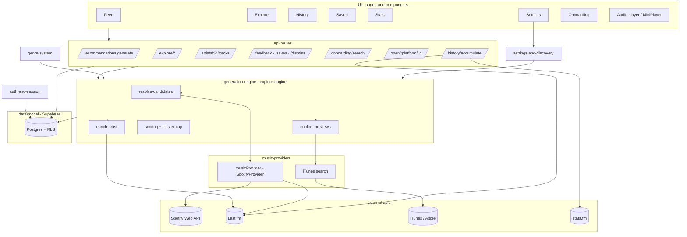

# flipside — Codebase Wiki

A cross-linked map of how flipside actually works, verified by reading the code on
2026-06-06. Pages link with Obsidian-style `[[wikilinks]]`. Start here, then follow
links into the subsystem you care about.

> **For agents/LLMs:** read this hub first, then the specific page for the area you're
> editing. Don't infer architecture from training priors — every claim here was read
> out of the code. If you change behavior, update the relevant page (and its
> `updated:` date).

## What flipside is

flipside is a **music-discovery app** (Next.js 16, App Router, React 19, Supabase).
You log in with **just a username** — there is no Spotify login. It builds two
personalized discovery surfaces:

- the **Feed** ("For You") — a scored, diversity-capped stack of artist cards, and
- **Explore** — four themed rails (After Hours / Uncharted / Rabbit Holes / Curveballs).

Recommendations are grown by walking the **Last.fm** artist-similarity graph from your
seeds, resolving candidate names to artists, scoring them by a tunable
popularity curve, capping genre clustering for diversity, and confirming each artist
has a **playable 30-second preview** (iTunes first, Spotify fallback) before showing it.

## The map

## Pages

| Page | What it covers |
|---|---|
| [[architecture-overview]] | The big picture: route groups, request lifecycle, the generation flow end-to-end |
| [[auth-and-session]] | Username-only NextAuth, HMAC, JWT cookie, CSRF, middleware gate |
| [[data-model]] | Every Supabase table, columns, RLS, RPCs |
| [[generation-engine]] | The Feed pipeline: seeds → similarity → score → diversity → confirm → cache |
| [[explore-engine]] | The four Explore rails and how each is built |
| [[music-providers]] | The `musicProvider` abstraction and the breakers/limiters around external calls |
| [[external-apis]] | Catalog of every external service: Spotify, Last.fm, iTunes, stats.fm — what each provides |
| [[api-routes]] | The HTTP surface: every route, auth, inputs, what it calls |
| [[pages-and-components]] | Screens, shared components, client hooks, playback + "open in platform" UX |
| [[genre-system]] | The 4-level genre tree, normalization, adjacency scoring, build scripts |
| [[settings-and-discovery]] | Discovery settings model (obscurity, curve, adventurous, deep discovery) |
| [[infra-and-ops]] | next.config/CSP, middleware, cron, color extraction, scripts |
| [[spotify-dependency]] | **The analysis**: exactly what Spotify is used for and how replaceable it is |

## Sources

Raw research sweeps (with inline citations + confidence labels) live in `docs/_sweeps/`:
`research-A-deezer-apple.md`, `research-B-musicbrainz-lastfm.md`, `research-C-spotify-state.md`.
Historical design docs and PRDs are under `docs/superpowers/`.
